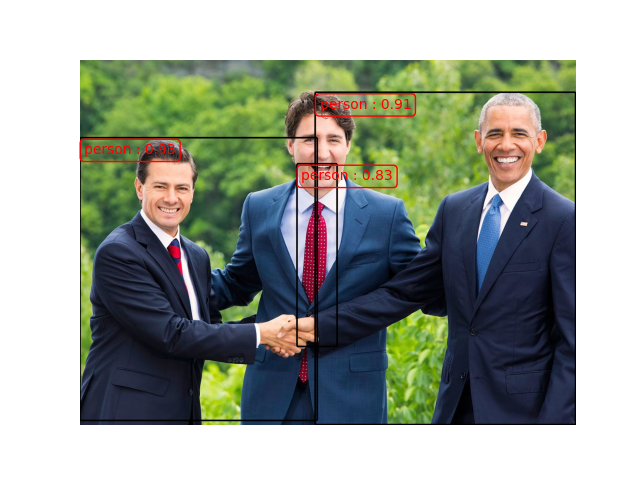

# spatial_people_counter

## Presentation

This project use object detection to count how many people are in a spatial location and track 
the number of people over time.

The idea is to call the file main.py every k minutes over image extracted from camera covering 
the monitored area.

## Usage

Use object detection on an image

```
python main.py -i path_to_image -t 0.8
```
   -i,--image		path to an image
   -t, --threshold	threshold to validate a prediction from a CNN model	  

The main file return the image with bounding boxes in the folder outputs and add a line 
on the current day logs.



```
...
17/05/2021 10:25:00 : 0 personnes 
17/05/2021 10:30:00 : 1 personnes 
17/05/2021 10:35:00 : 3 personnes #new_line
```

Parse the logs of one day

```
python utils/visualize_logs.py -p path_to_logs
```

   -p,--path		path to the logs

Add a figure in the logs folder


