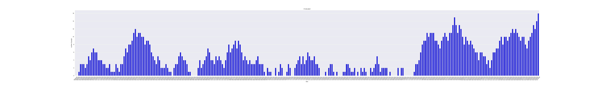

# spatial_people_counter

## Presentation

This project uses object detection to count people in a spatial location and track 
their number over time.

The idea is to call the file main.py every k minutes over image extracted from camera covering 
the monitored area.

This branch is a dockerized version of the scripts

## Usage

First build the docker image. Go in the project repository 
and type in cmd:

```
docker build -t <image_name> . 
```

Then run the image and use object detection on an image

```
docker run python-spc -i path_to_image -t 0.8 -m "https://tfhub.dev/tensorflow/centernet/resnet50v1_fpn_512x512/1"
```
   -i,--image        path to an image
   -t, --threshold	threshold to validate a prediction from a CNN model	
   -m,--model        URL/path to the tensorflow model used for object detection   

The main file return the image with bounding boxes in the folder outputs and add a line 
on the current day logs.


```
...
17/05/2021 10:25:00 : 0 personnes 
17/05/2021 10:30:00 : 1 personnes 
17/05/2021 10:35:00 : 3 personnes #new_line
```

Parse the logs of one day

```
python utils/visualize_logs.py -p path_to_logs
```

   -p,--path		path to the logs

Add a figure in the logs folder



## Requierments 

* docker
* tensorflow >= 2.5
* tensorflow-hub == 0.12.0
* seaborn
* matplotlib
* numpy

